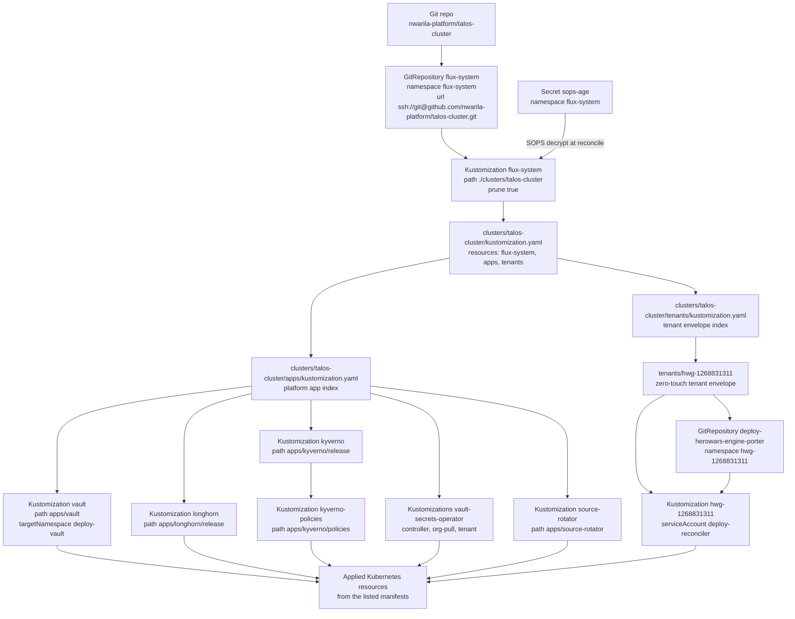
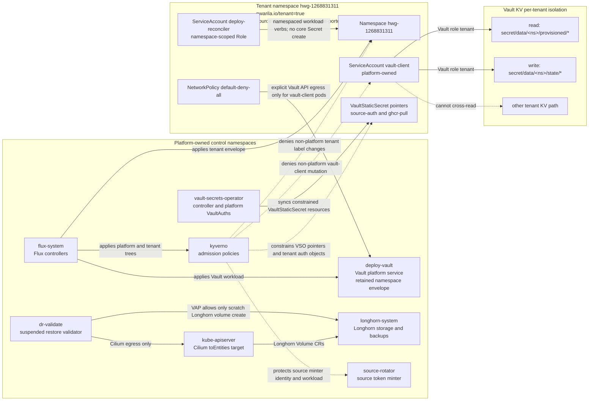
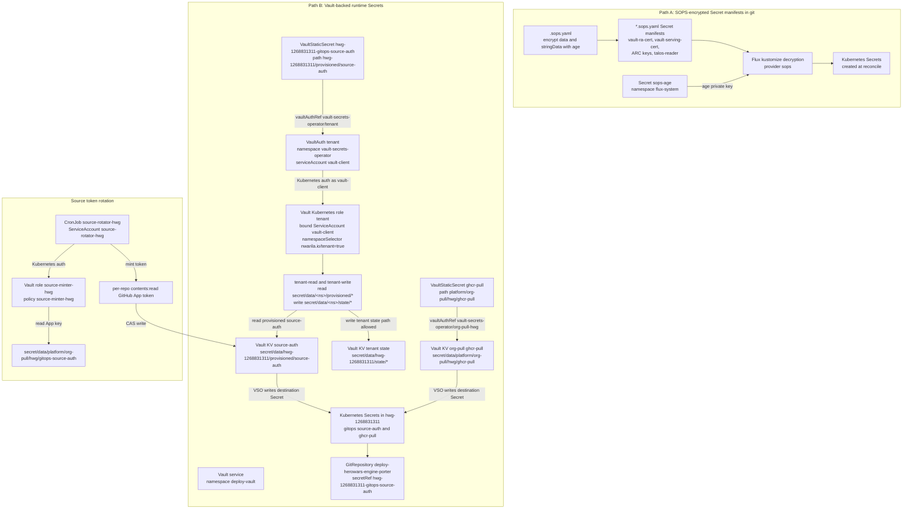
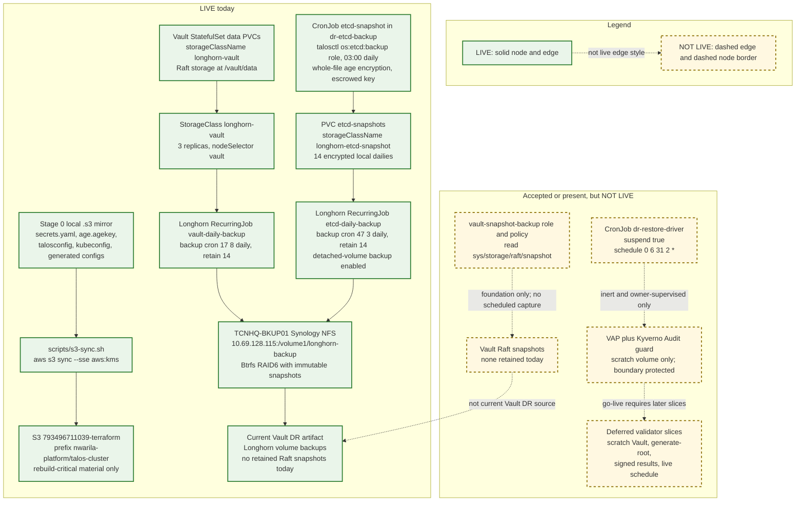

# Architecture Diagrams

This explanation records the current architecture from committed manifests and
accepted decision records. When a decision record's earlier convention differs
from the current manifests, the diagrams follow the current manifests.

## GitOps Reconciliation Flow

Source files verified for this diagram:
`clusters/talos-cluster/flux-system/gotk-sync.yaml`,
`clusters/talos-cluster/kustomization.yaml`,
`clusters/talos-cluster/apps/kustomization.yaml`,
`clusters/talos-cluster/tenants/kustomization.yaml`,
`clusters/talos-cluster/apps/vault-kustomization.yaml`,
`clusters/talos-cluster/apps/longhorn/kustomization-flux.yaml`,
`clusters/talos-cluster/apps/kyverno/kustomization-flux.yaml`,
`clusters/talos-cluster/apps/kyverno/kustomization-policies.yaml`,
`clusters/talos-cluster/apps/vault-secrets-operator/kustomization-controller.yaml`,
`clusters/talos-cluster/apps/vault-secrets-operator/kustomization-org-pull.yaml`,
`clusters/talos-cluster/apps/vault-secrets-operator/kustomization-tenant.yaml`,
`clusters/talos-cluster/apps/kustomization-source-rotator.yaml`,
`clusters/talos-cluster/tenants/hwg-1268831311/kustomization.yaml`, and
`clusters/talos-cluster/tenants/_template/zero-touch/base/gitrepository.yaml`,
`clusters/talos-cluster/tenants/_template/zero-touch/base/kustomization-flux.yaml`,
and `clusters/talos-cluster/tenants/_template/zero-touch/base/kustomization.yaml`.

## Trust Boundaries

Source files verified for this diagram:
`clusters/talos-cluster/tenants/deploy-vault/namespace.yaml`,
`clusters/talos-cluster/apps/vault/base/kustomization.yaml`,
`clusters/talos-cluster/apps/vault/base/allow-tenant-vault-api-ingress.yaml`,
`clusters/talos-cluster/tenants/hwg-1268831311/kustomization.yaml`,
`clusters/talos-cluster/tenants/_template/zero-touch/base/namespace.yaml`,
`clusters/talos-cluster/tenants/_template/zero-touch/base/networkpolicy-default-deny.yaml`,
`clusters/talos-cluster/tenants/_template/zero-touch/base/networkpolicy-allow-vault-egress.yaml`,
`clusters/talos-cluster/tenants/_template/zero-touch/base/vault-client-serviceaccount.yaml`,
`clusters/talos-cluster/tenants/_template/zero-touch/base/deploy-reconciler-rbac.yaml`,
`clusters/talos-cluster/apps/vault/vault-config/auth/kubernetes/roles/tenant.json`,
`clusters/talos-cluster/apps/vault/vault-config/policies/tenant-read.hcl`,
`clusters/talos-cluster/apps/vault/vault-config/policies/tenant-write.hcl`,
`clusters/talos-cluster/apps/kyverno/policies/protect-tenant-label.yaml`,
`clusters/talos-cluster/apps/kyverno/policies/protect-vault-client-serviceaccount.yaml`,
`clusters/talos-cluster/apps/kyverno/policies/restrict-vso-org-pull-secrets.yaml`,
`clusters/talos-cluster/apps/kyverno/policies/protect-source-minter.yaml`,
`clusters/talos-cluster/apps/vault-restore-validator/validatingadmissionpolicy.yaml`,
`clusters/talos-cluster/apps/vault-restore-validator/ciliumnetworkpolicy-egress.yaml`,
`docs/decision-records/repo/0011-auto-discover-deploy-repositories.md`,
`docs/decision-records/repo/0015-use-vault-secrets-operator-for-workload-secrets.md`,
`docs/decision-records/repo/0017-fold-vault-into-talos-cluster-as-a-platform-service.md`,
`docs/decision-records/repo/0020-automate-vault-restore-validation.md`, and
`docs/decision-records/repo/0024-two-layer-enforcement-of-restore-validator-boundary.md`.

The exact tenant Vault policy paths in the current files are
`secret/data/<ns>/provisioned/*` for tenant reads and
`secret/data/<ns>/state/*` for tenant writes, where the policy template derives
`<ns>` from the authenticated service account namespace.

## Secret Flow

Source files verified for this diagram:
`.sops.yaml`, `clusters/talos-cluster/flux-system/gotk-sync.yaml`,
`clusters/talos-cluster/apps/actions-runner-controller/kustomization-scale-set.yaml`,
`clusters/talos-cluster/apps/vault-aws-access/kustomization.yaml`,
`clusters/talos-cluster/apps/vault-tls/kustomization.yaml`,
`clusters/talos-cluster/apps/vault-secrets-operator/tenant/vaultauth-tenant.yaml`,
`clusters/talos-cluster/apps/vault-secrets-operator/org-pull/vaultauth-org-pull-hwg.yaml`,
`clusters/talos-cluster/apps/vault-secrets-operator/org-pull/vaultauth-org-pull-nwp.yaml`,
`clusters/talos-cluster/tenants/_template/zero-touch/base/vaultstaticsecret-gitops-source-auth.yaml`,
`clusters/talos-cluster/tenants/_template/zero-touch/base/vaultstaticsecret-ghcr-pull.yaml`,
`clusters/talos-cluster/tenants/hwg-1268831311/kustomization.yaml`,
`clusters/talos-cluster/apps/source-rotator/cronjob.yaml`,
`clusters/talos-cluster/apps/source-rotator/configmap.yaml`,
`clusters/talos-cluster/apps/source-rotator/serviceaccount.yaml`,
`clusters/talos-cluster/apps/vault/vault-config/auth/kubernetes/roles/tenant.json`,
`clusters/talos-cluster/apps/vault/vault-config/auth/kubernetes/roles/source-minter-hwg.json`,
`clusters/talos-cluster/apps/vault/vault-config/policies/tenant-read.hcl`,
`clusters/talos-cluster/apps/vault/vault-config/policies/tenant-write.hcl`, and
`clusters/talos-cluster/apps/vault/vault-config/policies/source-minter-hwg.hcl`.

## DR Tiers

Source files verified for this diagram:
`cluster/config.env`, `scripts/s3-sync.sh`,
`docs/decision-records/repo/0006-etcd-snapshot-automation.md`,
`docs/decision-records/repo/0014-use-stage-1-local-backup-server-for-dr.md`,
`docs/decision-records/repo/0021-synology-nfs-backup-target-for-longhorn.md`,
`docs/runbooks/dr-stage1-backup.md`,
`docs/runbooks/restore-drill-backup-dr.md`,
`docs/decision-records/repo/0026-in-cluster-etcd-snapshot-pipeline.md`,
`clusters/talos-cluster/apps/dr-etcd-backup/cronjob.yaml`,
`clusters/talos-cluster/apps/dr-etcd-backup/ciliumnetworkpolicy-egress.yaml`,
`clusters/talos-cluster/apps/longhorn-etcd-storage/storageclass.yaml`,
`clusters/talos-cluster/apps/longhorn-etcd-storage/recurringjob.yaml`,
`clusters/talos-cluster/apps/vault/base/vault-statefulset.yaml`,
`clusters/talos-cluster/apps/vault/base/vault.hcl`,
`clusters/talos-cluster/apps/longhorn-vault-storage/storageclass.yaml`,
`clusters/talos-cluster/apps/longhorn-vault-storage/recurringjob-vault-backup.yaml`,
`clusters/talos-cluster/apps/longhorn/release/helmrelease.yaml`,
`clusters/talos-cluster/apps/dr-backup/namespace.yaml`,
`clusters/talos-cluster/apps/dr-backup/serviceaccount.yaml`,
`clusters/talos-cluster/apps/dr-backup/ciliumnetworkpolicy-egress.yaml`,
`clusters/talos-cluster/apps/vault/vault-config/auth/kubernetes/roles/vault-snapshot-backup.json`,
`clusters/talos-cluster/apps/vault/vault-config/policies/vault-snapshot-backup.hcl`,
`clusters/talos-cluster/apps/vault-restore-validator/README.md`,
`clusters/talos-cluster/apps/vault-restore-validator/cronjob.yaml`,
`clusters/talos-cluster/apps/vault-restore-validator/validatingadmissionpolicy.yaml`,
`clusters/talos-cluster/apps/vault-restore-validator/ciliumnetworkpolicy-egress.yaml`, and
`clusters/talos-cluster/apps/kyverno/policies/protect-dr-validate-boundary.yaml`.

Solid arrows are live today. Dashed arrows are accepted or present as
implementation material, but not live scheduled DR.

